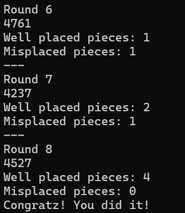

<!-- PROJECT LOGO -->

  <h3>
     
    Mastermind Game
  </h3>

   

 

 

 

 

 

## Project Info
**Role:** Solo Developer
 
**Duration:** 5 hours
 
**Tech:** C#

> [!NOTE]
> **Installation GUIDE:**
>  
> .NET SDK Required: .NET SDK (version [insert version] or later)
> How to Run:
> - Clone the repository.
> - Open the terminal and navigate to the project directory.
> Run the game using:

## Introduction

*Cows and Bulls* is a logic-based number guessing game that I developed as a personal project, showcasing my skills in game development and design. The game offers a fun and intellectually stimulating experience.

The idea was inspired by a friend who loved playing the original game and encouraged me to create a digital version. I added a unique twist to the result display using a virtual **invoice machine**, which prints out the results of each guess. This concept worked successfully and added a creative flair to the gameplay.

##  Main Mechanics

- The game randomly generates a **4-digit number** using digits from 0 to 9, with **no repeating digits**.
- Players attempt to guess this number.
- After each guess:
  - A **bull** means a correct digit in the correct position.
  - A **cow** means a correct digit but in the wrong position.

The player uses these clues to narrow down the correct number through logic and deduction.

## Features

#### High Score System with PlayFab

  
  

I integrated the **PlayFab API** to allow player names and high scores to be saved online.  
A custom service manager sends requests from Unity to the PlayFab server, storing player data and displaying a leaderboard.  
Players can also generate random names for a faster experience.

#### Share Results on Social Media

To increase player engagement, I added a feature that allows players to **share their game results** on social media.  
I captured all guesses and progress in a single camera view and generated a combined screenshot. Players can then share this image with a custom message.

#### Enhanced Guessing Aids

To help players guess more effectively, I added interactive **analytics tools**:
- Players can **click numbers** to highlight or mark them.
- Two types of marks are supported: `"X"` for ruled-out digits and `"O"` for likely candidates.
