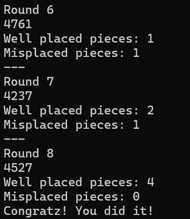

<!-- PROJECT LOGO -->
<div>
  <h3>
    <br/>
    Mastermind Game
  </h3>
</div>   

<br/>

<br/>

<br/>

<br/>

<br/>

## Project Info
**Role:** Solo Developer
<br/>
**Duration:** 5 hours
<br/>**Tech:** C#, .NET 6.0

## Introduction

Mastermind is a classic code-breaking logic game I recreated as a terminal-based C# project. The game challenges players to decipher a hidden code using logical deduction within a limited number of attempts.

I developed this project as part of my application to the Savvy Kickstarter Program

And I previously built a similar logic game called Cows and Bulls using C# and Unity. It also explores feedback-based number guessing. [here](https://github.com/weex1997/CowsAndBullsGame.git)

## How to Run:
- Clone the repository.
- Open the terminal and navigate to the project directory.
- Run the game using:
```bash
./MastermindGame
```
- You can specify the hidden code by using the parameter `-c` and follow it with the code
```bash
./MastermindGame -c 1234
```
 - Specify the attempts by using the parameter `-t` and follow it with the number of attempts
```bash
./MastermindGame -t 15
```
- End the game file by the sequence `Ctrl + Z`.

  ## Technical Explanation & Main Mechanics

- The game settings handle the main variables, allowing customization of the code, the number of attempts, and even the length of the code.

[GameSettings.cs](https://github.com/weex1997/MastermindGame/blob/a1633f472ffebb522f011ac01e78adfd0bb7359f/src/GameSettings.cs#L1)

```csharp
public abstract class GameSettings
{
    public int codeLength = 4;
    public string code { get; set; } = "";
    public int maxAttempts { get; set; } = 10;

}
```
- The game randomly generates a **4-digit number** using digits from 0 to 8, with **no repeating digits**.

[CodeGenerator.cs](https://github.com/weex1997/MastermindGame/blob/a1633f472ffebb522f011ac01e78adfd0bb7359f/src/CodeGenerator.cs#L6)

```csharp
public string RandomHiddenCodeGenerator(int codeLength)
    {

        for (int j = 0; j < codeLength; j++)
        {
            Random random = new Random();
            int rand = random.Next(0, 8);

            // Ensure no duplicate digits
            while (codeList.Contains(rand))
            {
                rand = random.Next(0, 8);
            }
            codeList.Add(rand); // Add the unique digit to the list
        }

        // Convert list of digits into a string
        string code = string.Join("", codeList);

        return code;
    }
```

- Check the player's guess by providing feedback.
  - Well-placed pieces (X) – correct digit in the correct position.
  - Misplaced pieces (Y) – correct digit but in the wrong position.

[CodeChecker.cs](https://github.com/weex1997/MastermindGame/blob/a1633f472ffebb522f011ac01e78adfd0bb7359f/src/CodeChecker.cs#L6)

```csharp
    public (int wellPlaced, int misplaced) CheckPlaces(string guess, string code, int codeLength)
    {
        int wellPlaced = 0;
        int misplaced = 0;

        //Loop to check numbers ordered one by one and compare them
        for (int i = 0; i < codeLength; i++)
        {
            if (code[i] == guess[i])
            {
                wellPlaced++;
            }
            //If the guess number is not equal to the code, then check the total of the code if contains the number
            else if (code.Contains(guess[i]))
            {
                misplaced++;
            }
        }

        return (wellPlaced, misplaced);
    }
```
- Check the Rules of the code are:
  - The code must contain only numbers.
  - Allowed digits range from 0 to 8.
  - The code must be exactly the same length as defined in the game settings.
  - No repeated digits are allowed in the code.

[GameManager.cs](https://github.com/weex1997/MastermindGame/blob/a1633f472ffebb522f011ac01e78adfd0bb7359f/src/GameManager.cs#L79)

```csharp
  public bool PassTheRules(string code)
    {
        if (code.All(c => char.IsDigit(c) && c >= '0' && c <= '8') && code.Length == codeLength && code.Distinct().Count() == code.Length)
        {
            return true;
        }
        else return false;
    }
```

